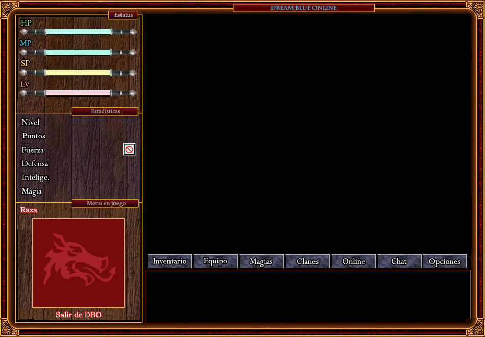

# Dream Blue Online — cliente web

Una reimplementación del cliente de Dream Blue Online que corre en el navegador.
Habla el **mismo protocolo** que el cliente de Windows, así que se conecta a un
servidor de Dreaminze Engine sin tocarle nada.



No es un emulador ni un envoltorio: es el cliente reescrito en JavaScript, con la
interfaz original recortada del ejecutable. Mapas, sprites, música, combate,
clima, inventario, equipo, magias, chat y el registro de cuentas y personajes.

---

## Qué hay que levantar

El navegador no puede abrir sockets TCP crudos, así que hace falta un puente:

```
navegador  --WebSocket-->  :4002 wsbridge  --TCP-->  :4000 adapter  --TCP-->  :4001 servidor
```

Las tres primeras piezas son Python sin dependencias. El servidor es el tuyo.

| Pieza | Qué hace |
|---|---|
| `_web/servidor.py` | sirve la página en el 8080, sin caché |
| `_servicios/wsbridge.py` | traduce WebSocket a TCP |
| `_servicios/adapter.py` | arregla diferencias de protocolo, y registra todo |

### Arranque

```bash
python _servicios/adapter.py 127.0.0.1:4001
python _servicios/wsbridge.py
python _web/servidor.py 8080
```

Y abrir `http://127.0.0.1:8080`.

El primer argumento del adaptador es **dónde está tu servidor**. Puede ser otra
máquina: `python _servicios/adapter.py mi.servidor.com:4000`.

Los tres escuchan en `0.0.0.0`, así que desde otro equipo de la red o la VPN se
entra con `http://<tu-ip>:8080`.

---

## El adaptador, y cuándo apagarlo

Se sienta entre el cliente y el servidor y corrige tres cosas que hacían falta
para juntar el cliente de 2006 con el servidor de 2007:

1. **El campo Suerte.** El servidor 1.3 lo manda en el paquete de clases; el
   cliente 3.01 no lo conoce y lee todo corrido, da todas las razas por
   bloqueadas y revienta al crear personaje.
2. **La versión** del login, que el cliente R2 anuncia distinta.
3. **El relleno antitrampas**, cuatro campos constantes que el servidor valida.

Si tu servidor está modificado, esos arreglos pueden ser justo lo que te rompe
el login. Se apagan con:

```bash
python _servicios/adapter.py mi.servidor.com:4000 --crudo
```

Así el adaptador solo mira y registra, sin tocar un byte. Todo lo que pasa queda
en `_servicios/adapter_log.txt`: es la mejor herramienta para ver por qué algo no
funciona.

---

## Los gráficos y los mapas son TUYOS

Este repo trae los assets de la instalación con la que se desarrolló. **Si tu
servidor tiene otros mapas, otros tiles o sprites nuevos, hay que regenerarlos
desde tu cliente**, o verás los de aquí.

### Mapas

```bash
python _web/build_maps.py "C:/ruta/a/tu/cliente"
```

Lee los `map*.dat` de esa carpeta y los empaqueta en `_web/assets/maps.bin`
(210 mapas, 6,5 MB en crudo, 0,26 MB comprimido). El cliente web los carga
todos al arrancar: cambiar de mapa no descarga nada.

### Hojas de gráficos

```bash
python _web/build_gfx.py "C:/ruta/a/tu/cliente/GFX"
```

Acepta PNG y BMP, así que se le puede apuntar directo a la carpeta `GFX` del
cliente de Dreaminze. Convierte a **WebP sin pérdida** horneando el color-key
negro de DirectDraw como canal alfa — mismos píxeles exactos, una fracción del
tamaño (90 MB → 8 MB en una prueba real).

> Las hojas de más de 16383 px de lado no caben en WebP (la de sprites de
> Dreaminze mide 384×20000). Esas se guardan en PNG y el cliente las busca
> igual: prueba `.webp` y si no está, `.png`.

### ⚠️ El paso del índice de tiles

En `_web/src/maps.js`:

```js
export const STRIDE = 14;
```

**Es el ancho de tu hoja de tiles dividido entre 16.** Las de aquí miden 224 px,
de ahí el 14. Las del cliente de Dreaminze miden 256 → hay que poner **16**.

Con el número equivocado los mapas salen con las casillas corridas y el mundo es
un rompecabezas. Es el error más fácil de cometer y el más confuso de
diagnosticar.

---

## Mapa del mundo

`http://127.0.0.1:8080/mapa_total.html` muestra los 210 mapas cosidos por sus
warps, con buscador, zoom y fichas.

Para regenerarlo con tus mapas:

```bash
python _web/mundo.py "C:/ruta/a/tu/cliente"
```

Los `mapN.dat` no guardan su posición en el mundo (los campos Up/Down/Left/Right
están todos en cero), así que la geografía se reconstruye distinguiendo
**costuras** de **puertas**: un warp en un borde que aterriza en el borde opuesto
del vecino significa que los dos mapas son contiguos; uno que aterriza en mitad
del destino es una tienda o una cueva y no implica nada.

---

## Lo que falta

Tienda, banco, comercio entre jugadores, ventana de chat privado, clanes, grupo,
emoticonos, cambio de apariencia y los editores de administrador. Los formatos de
paquete ya están capturados (`SAVEITEM` 24 campos, `SAVENPC` 47, `SAVESPELL` 17);
lo que falta es la interfaz.

La lista completa, con lo hecho y lo pendiente, está en
[`_web/HOJA_DE_RUTA.md`](_web/HOJA_DE_RUTA.md), junto con todo lo que se dedujo
del protocolo para no tener que volver a averiguarlo.

---

## Cómo se hizo

Nunca se descompiló nada. El cliente original va empaquetado con MoleBox y sus
cadenas están cifradas en disco, pero en memoria están en claro: volcando el
proceso vivo apareció la tabla entera de comandos (803 entradas, en
`_web/tabla_cliente.txt`). Los assets salieron llamando a las propias funciones
del sistema de archivos virtual de MoleBox con frida. El protocolo, de escuchar
el tráfico real.

Y las reglas de dibujo —qué fotograma va en cada pose, en qué orden se superpone
el equipo— se midieron: se mueve el personaje desde el cliente web, se captura la
ventana del cliente de Windows y se busca por fuerza bruta qué combinación
reproduce esos píxeles. Por eso el muñeco sale **idéntico píxel a píxel** en las
cuatro direcciones, con y sin equipo.

---

## Requisitos

Python 3 (sin dependencias para servir y jugar) y un navegador moderno.
Para regenerar los assets, además, **Pillow**:

```bash
pip install pillow
```
